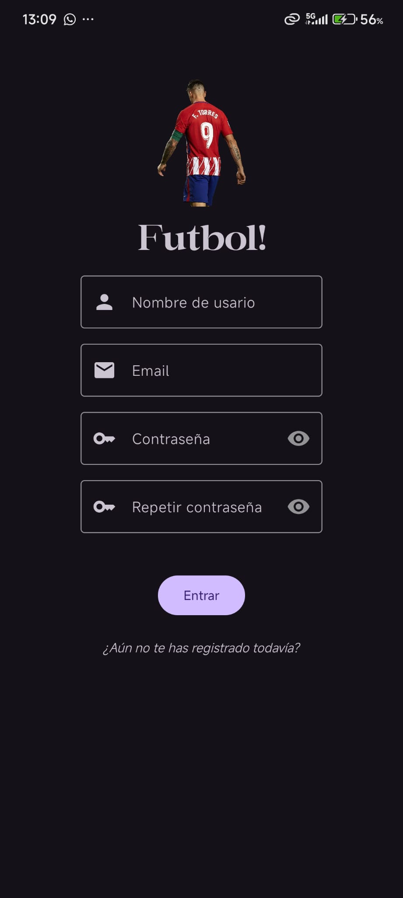
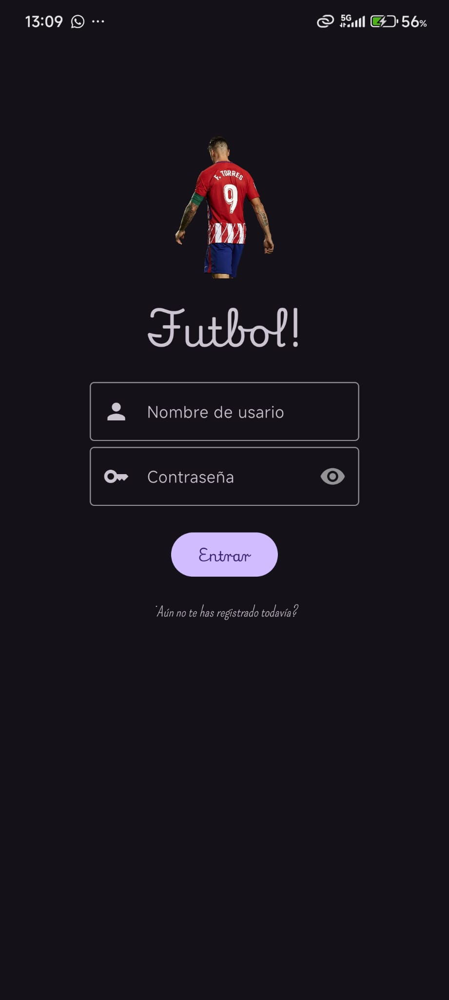
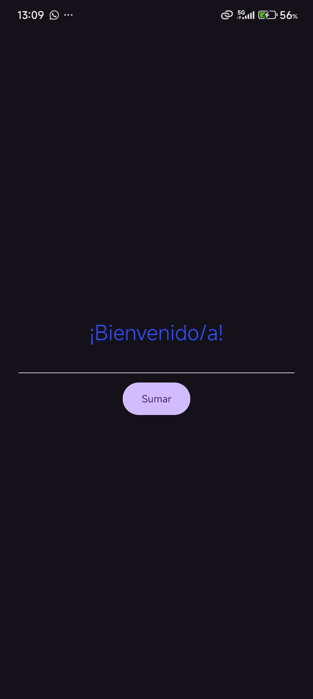

# First2526 - App de Registro y Login

Esta es una aplicación sencilla para Android que demuestra un flujo completo de registro y autenticación de usuarios, incluyendo validación de formularios, almacenamiento seguro de credenciales y un saludo personalizado.

## Funcionalidades Principales

-   **Registro de Usuario:**
    -   Un formulario solicita nombre de usuario, email y contraseña.
    -   Se realizan validaciones para asegurar que los campos no estén vacíos, que el email tenga un formato válido y que las contraseñas coincidan.
    -   La contraseña se hashea usando SHA-256 antes de ser guardada en `SharedPreferences` para mayor seguridad.

-   **Login de Usuario:**
    -   El usuario inicia sesión con su nombre de usuario y contraseña.
    -   La app verifica las credenciales contra los datos guardados en `SharedPreferences`.
    -   Si el acceso es exitoso, el usuario es redirigido a la pantalla principal.

-   **Pantalla Principal:**
    -   Muestra un mensaje de bienvenida personalizado, saludando al usuario por su nombre.
    -   El nombre de usuario se transfiere desde la pantalla de Login a través de un `Bundle`.

## Estilo y Diseño

The visual style of the application aims to be modern and consistent, with a theme reminiscent of a soccer field.

-   **Paleta de Colores:** Se utiliza un degradado de verdes (`@color/cespedClaro` a `@color/cespedOscuro`) como fondo principal en todas las pantallas, creando una atmósfera fresca y unificada.
-   **Tipografía:** Se emplean fuentes personalizadas para darle un carácter único a la aplicación:
    -   `maglisto`: Usada para el nombre de la app, aportando un toque estilizado.
    -   `nueva` y `pompiere`: Usadas en diferentes partes de la interfaz para mejorar la jerarquía visual.
-   **Iconografía:** Se utilizan iconos de Material Design para mejorar la usabilidad en los campos de texto (usuario, email, contraseña).

## Capturas de Pantalla

**Pantalla de Bienvenida (Splash Screen)**

**Pantalla de Registro**

**Pantalla de Login**

**Pantalla Principal**
